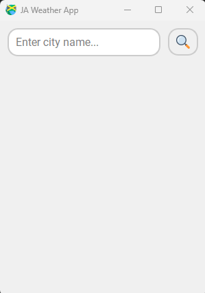
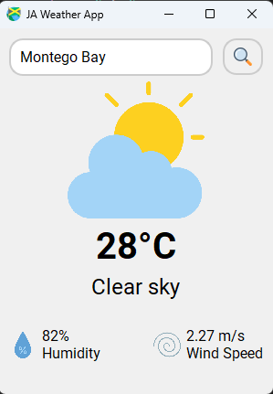

# JA Weather App

## Introduction

JA Weather App is a desktop-based weather application developed using PyQt5. It is designed to display weather information for all the cities in Jamaica. The app fetches real-time weather data using the OpenWeatherMap API, providing an easy-to-use interface for users to access current weather conditions.

## Purpose

The main purpose of the JA Weather App is to provide quick and reliable weather information for various cities across Jamaica. It is particularly useful for individuals who need up-to-date weather forecasts, including temperature, weather descriptions, humidity levels, and wind speed.

## Features

- **Real-time Weather Data**: Retrieves current weather data for cities in Jamaica using the OpenWeatherMap API.
- **User-friendly Interface**: Allows users to enter a city name and view weather details with a simple click.
- **Weather Details**: Displays temperature, weather description, humidity, and wind speed.
- **Search Functionality**: Easily search for weather information by entering the city name in the search bar.

## Components

1. **Weather Display**: Shows detailed weather information such as temperature, humidity, and wind speed.
2. **Search Bar**: Users can type the name of a city in Jamaica to retrieve weather data.
3. **API Integration**: Utilizes the OpenWeatherMap API to fetch real-time weather information.

## Getting Started

1. **Run the Application**: Open `Main.py` to start the application.
2. **Enter City**: Use the input box to enter a city name.
3. **View Weather**: Click the search icon to view current weather details.

## Screenshots

### Main Interface

### Weather Details

## How to Use

- **Search**: Enter the name of a city in the search bar.
- **View Details**: Click on the search button to fetch and display weather data.
